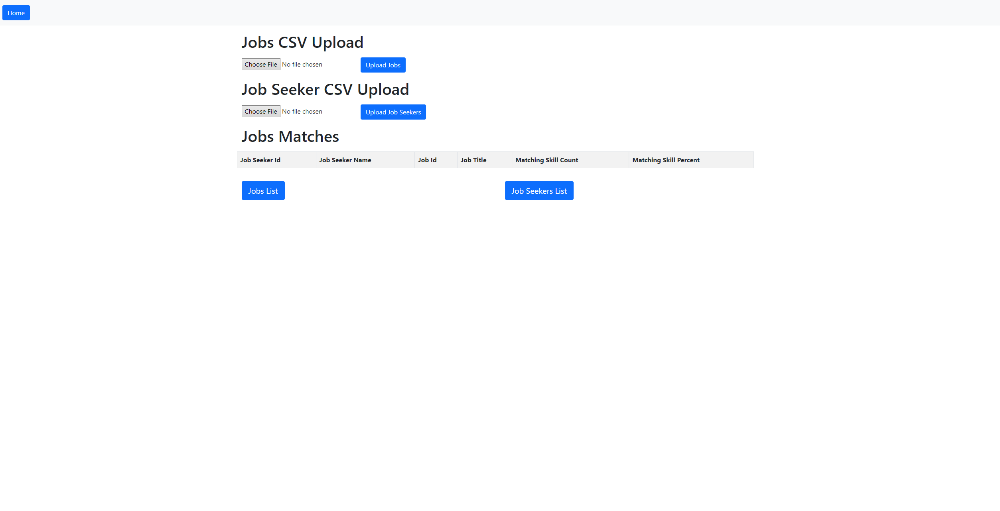
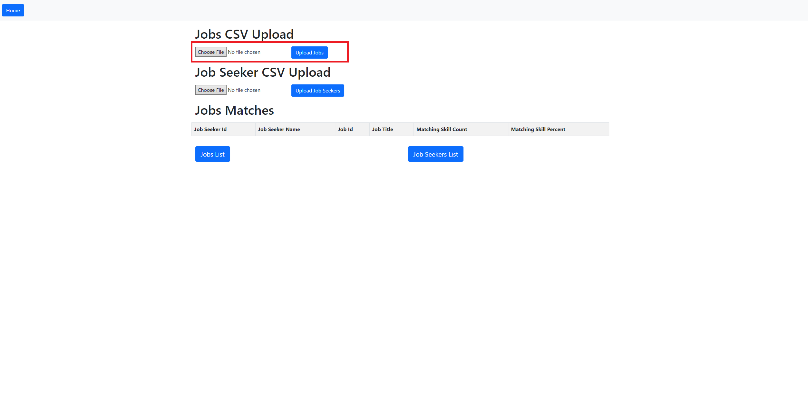
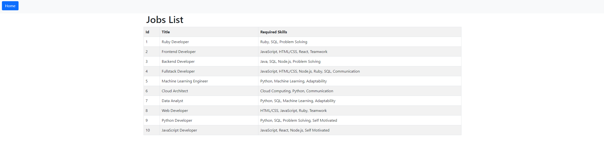
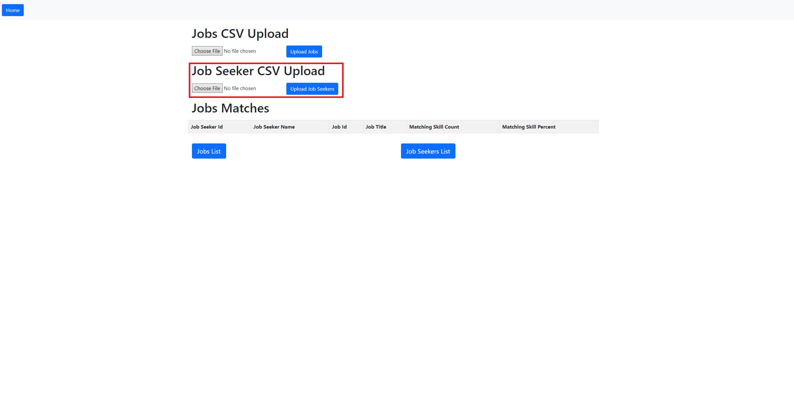
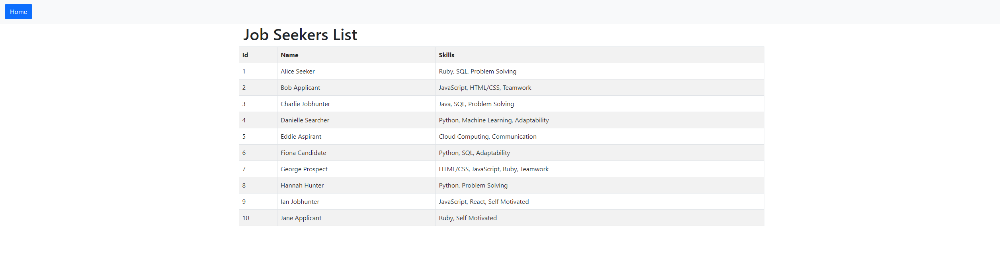
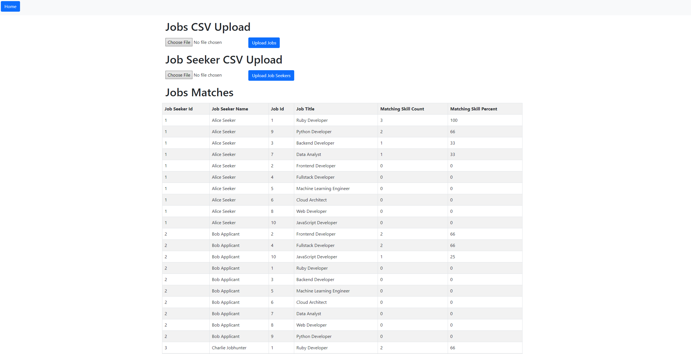

# README

This project is to develop a basic recommendation engine for a job-matching platform. The goal of the engine is to suggest jobs to jobseekers based on their skills and the required skills for each job.

this project would accept 2 csv files, one for jobs and another for job seekers.

### Running
to access the app run `rails s`. You can access the app by visiting `localhost:3000` in your browser. 

### Runthrough

when you first visit the app, it would drop you off at the root page.

To upload job from the csv you need to do it in the job csv upload part of the page where you put the file in and click on the "Upload Jobs".

once it's uploaded you can click on the "Job List" button where it would bring you to the job list page.

You would do the same for job seekers upload.

you can view the job seeker lists when you click on the "Job Seeker List"

once you uploaded both the jobs and jobseeker csv, when you are back in the root page, it would automatically generate the table for the job matching.

### Tests
Run `bundle exec rspec` to run the tests